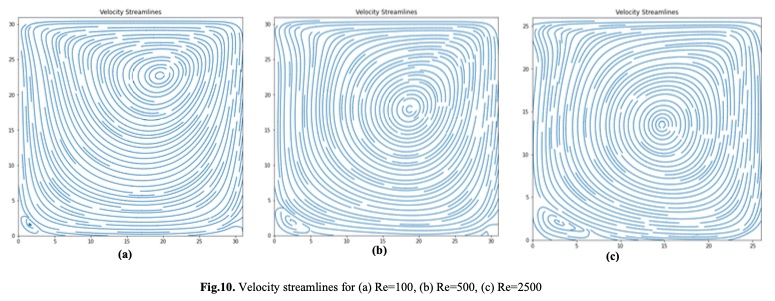

# Hey, I'm Ravin 👋

**Senior Mechanical Engineer · Thermal & CFD Enthusiast · Toronto 🇨🇦**

*I make things cooler — literally.*

I spend my days simulating heat, airflow, and fluid dynamics so engineers don't have to find out the hard way that something is on fire. Currently a Senior Mechanical Engineer in the EV space, but my heart is in electronics cooling — GPUs, data centres, heat sinks, the whole thermal circus. I wrote a CFD solver from scratch in Python during my Master's at UofT and haven't stopped simulating since.

---

## 🔥 What I work on

- 🌡️ Conjugate heat transfer & forced convection CFD (Ansys Fluent, Icepak, OpenFOAM)
- ⚡ Electronics cooling — ICs, heat sinks, GPU-dense data centre environments
- 🚗 EV thermal systems, drivetrain simulation & SPH lubrication modelling
- 🐍 Python automation for Data Acquisition Systems - DAQ data pipelines (Dewesoft, MoTeC)

**Stack:**  `SolidWorks` · `Ansys Fluent` · `AEDT Icepak` · `OpenFOAM`  `Altair HyperWorks` · `Python` · `Autodesk`

🎓 MEng @ University of Toronto 

---

## 📂 Featured Projects

---

### 🏢 Data Centre Room Cooling — Hot/Cold Aisle CFD

> Thermal and airflow simulation of a small data centre with raised-floor plenum, hot/cold aisle containment, and CRAH units — evaluated against ASHRAE A1 thermal limits.

  
   
  <em>Velocity streamlines & rack surface temperature contour — hot/cold aisle airflow dynamics</em>

**What?** Modelled a 3D steady-state room with 8 server racks, raised-floor plenum supply, and a CRAH return. Evaluated rack inlet temperatures against ASHRAE guidelines.

**How?** Ansys AEDT Icepak with Boussinesq buoyancy approximation, realizable k-ε turbulence model, and rack loads modelled as porous-jump volumetric heat sources.

**Results?** Rack 3 showed the highest inlet temperature due to hot-air recirculation over the top of the rack row. Adding blanking panels and cold-aisle containment in the model dropped R3 inlet temperature by **4.2 °C** — small containment changes, outsized thermal impact.

🔗 [`datacenter-cfd-thermal`](https://github.com/vasanthravin/data-center-cfd-thermal-analysis)

---

### 🌡️ Heat Sink CFD — IC Junction Temperature Optimisation

> Parametric forced convection study of a finned heat sink on a 1 W surface-mounted IC (10×10 mm), sweeping inlet velocities from 0.5–8 m/s to identify the optimal cooling operating point.

  
   
  <em>Surface temperature contour & velocity pathlines at 1 m/s — fin-channel acceleration (peak 1.47 m/s) with contained thermal wake</em>

**What?** 3D conjugate heat transfer CFD study in Ansys Fluent to characterise how airflow velocity affects junction temperature, identify the curve "knee", and quantify diminishing-return effects at high velocities.

**How?** Structured hex mesh with boundary layer inflation on all solid surfaces. Steady-state k-ε realizable turbulence model. SIMPLE pressure–velocity coupling. Power-law curve fitted to parametric results in Python.

**Results?** Junction temperature dropped from **54.9 °C** at 0.5 m/s down to **28.9 °C** at 8 m/s — all well below the 85 °C limit. Optimal zone identified at **1–2 m/s**: doubling speed beyond that saves only 4 K while dramatically increasing fan power demand.

🔗 [`heatsink-cfd-thermal-analysis`](https://github.com/vasanthravin/heatsink-cfd-thermal-analysis)

---

### 🌀 Lid-Driven Cavity Flow — CFD Solver (Python)

> A 2D incompressible Navier–Stokes solver built from scratch, validating the classic lid-driven cavity benchmark across Reynolds numbers Re = 100, 500, and 2500.

  
   
  <em>Velocity streamlines for (a) Re=100 · (b) Re=500 · (c) Re=2500</em>

**What?** Implemented a finite-difference pressure–velocity solver (SIMPLE algorithm) in pure Python to simulate recirculating flows in a square cavity.

**How?** Built the solver from first principles using staggered grids, central differencing for diffusion, and upwind schemes for convection. Parametric sweeps across Re numbers capture the evolution from laminar single-vortex flow to complex multi-vortex structures.

**Results?** Streamline patterns match Ghia et al. (1982) benchmark data closely. At Re = 2500, secondary corner vortices emerge — a well-known hallmark of transitional cavity flow behaviour.

🔗 [`lid-driven-cavity-cfd`](https://github.com/vasanthravin/lid-driven-cavity-navier-stokes-solver)

---

*Automotive → Electronics → wherever the heat takes me 🔥*

